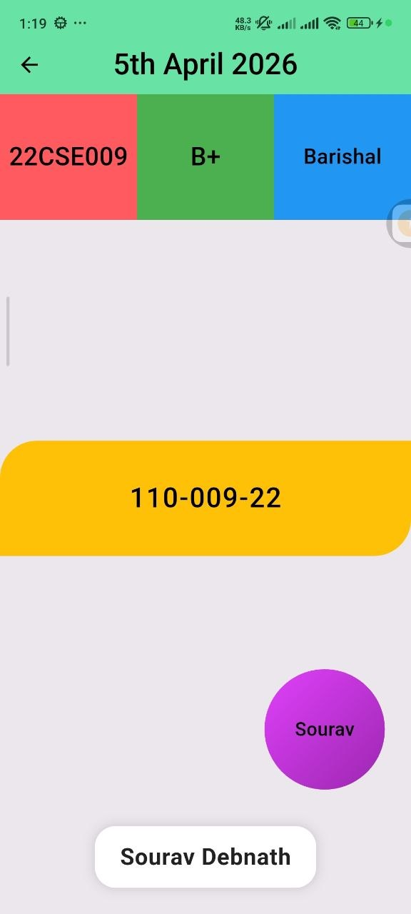
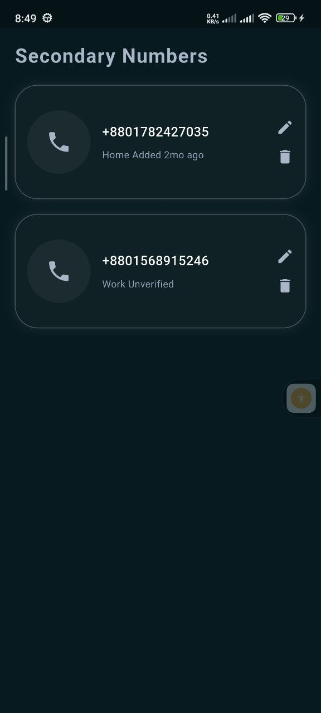
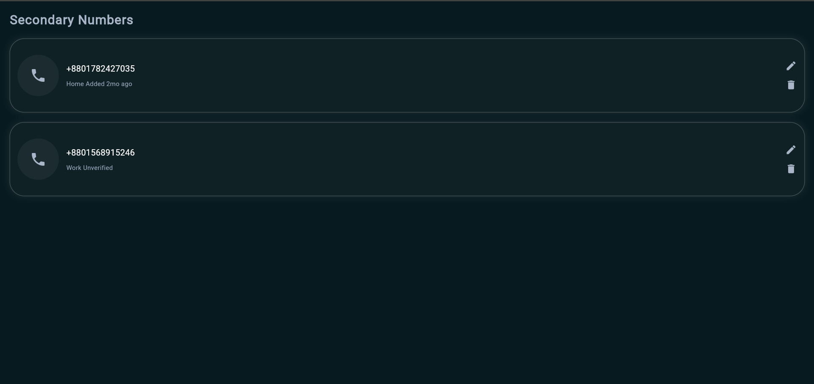

# Mobile App Development - Flutter UI Assignments

## 📌 Project Title
Flutter UI Layout Design Assignments

## 👨‍🎓 Student Information
- **Name:** Sourav Debnath
- **Roll:** 22CSE009
- **Department:** CSE
- **Batch:** 9th Batch
- **University:** University of Barishal

---

## 📖 Project Overview
This repository contains my **Flutter UI layout practice assignments** for the **Mobile App Development** course.

The designs were created based on classroom tasks and layout instructions provided by the course teacher.  
The main goal of this repository is to practice Flutter UI design using basic Flutter widgets and layout concepts.

These assignments focus on learning:
- Flutter UI layout building
- Widget arrangement and alignment
- Row and Column based design
- Container styling and decoration
- Basic responsive design concepts
- Beginner-friendly project organization

---

## 🎯 Assignment Objectives
The main objectives of these Flutter UI assignments are:

- To understand how Flutter layout works
- To practice `Row` and `Column`
- To use `Container` for custom UI sections
- To learn spacing and alignment
- To design interfaces using `Stack` and `Align`
- To apply `BoxDecoration`, colors, borders, shadows, and rounded corners
- To build beginner-friendly Flutter UI projects

---

# 📘 Assignment 01 - Basic Student Information UI

## 📝 Description
This layout is a colorful student information design created using Flutter basic widgets.

The UI displays:
- **Roll**
- **Blood Group**
- **District**
- **Registration Number**
- **Nickname**
- **Full Name**

### 🔧 Widgets Used
- `Scaffold`
- `AppBar`
- `Container`
- `Row`
- `Column`
- `Expanded`
- `Stack`
- `Align`
- `Center`
- `Text`
- `BoxDecoration`
- `BorderRadius`

### 🖼️ Output Screenshots

#### Mobile Output


#### Additional Output


---

# 📘 Assignment 02 - Layout Design 02 (Secondary Numbers UI)

## 📝 Description
This layout recreates the **Secondary Numbers** design shown in class.

The design includes:
- A dark themed background
- Two rounded contact cards
- Left-side circular phone icon
- Contact number text
- Subtitle text (Home/Work status)
- Right-side edit and delete icons

### 🔧 Widgets Used
- `Scaffold`
- `SafeArea`
- `Padding`
- `Container`
- `Row`
- `Column`
- `Expanded`
- `Icon`
- `Text`
- `BoxDecoration`
- `Border`
- `BorderRadius`
- `BoxShadow`

### 🖼️ Output Screenshots

#### Mobile Output


#### PC Output


> **Note:** If you rename the folder from `layout_desigh_02` to `layout_design_02`, update the image paths in this README as well.

---

## 🛠️ Technologies Used
- **Flutter**
- **Dart**
- **Material Design Widgets**

---

## 📂 Project Structure
```bash
Mobile-App-Development/
├── android/
├── ios/
├── lib/
│   ├── main.dart
│   └── tasks/
│       ├── layout_design_01.dart
│       └── layout_design_02.dart
├── screenshots/
│   ├── layout_design_01/
│   │   ├── image1.png
│   │   └── Screenshot 2026-04-05 005056.png
│   └── layout_design_02/
│       ├── SouravDebnath_22CSE009_Layout_Design_02_Mobile.png
│       └── SouravDebnath_22CSE009_Layout_Design_02_PC.png
├── test/
│   └── widget_test.dart
├── pubspec.yaml
└── README.md